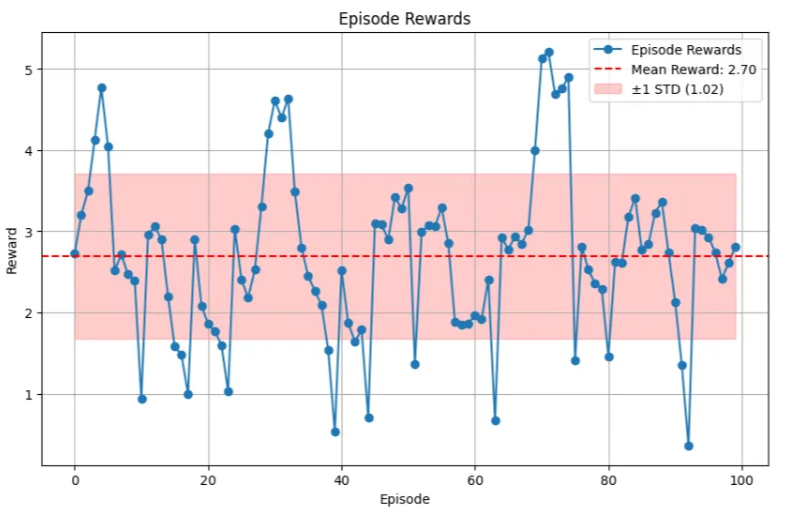
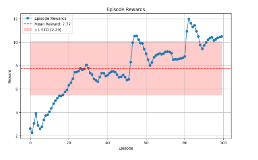
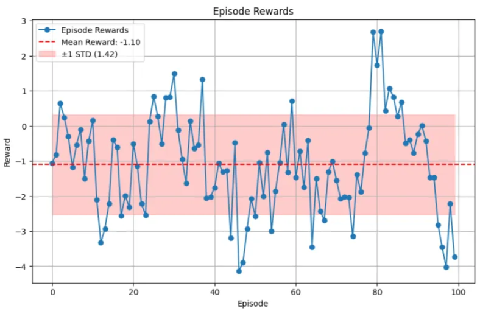
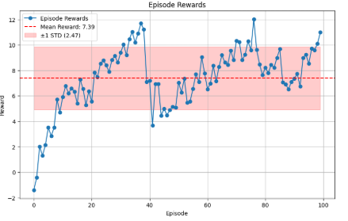
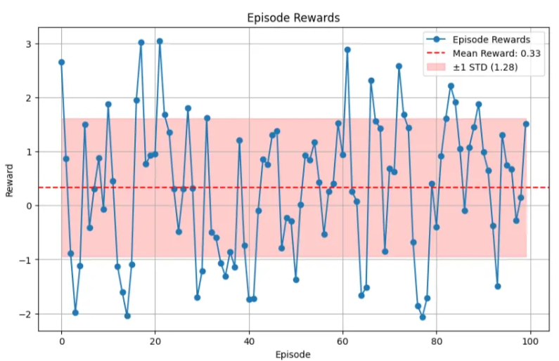
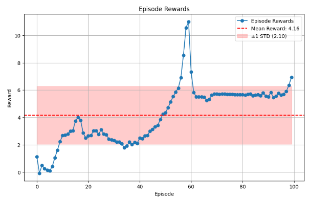

# Model-Based Offline Planning (MOPP)
This repository implements Model-Based Offline Planning (MOPP), a cutting-edge algorithm for Offline Reinforcement Learning (Offline RL). MOPP addresses the challenges of leveraging static datasets to optimize actions while avoiding out-of-distribution (OOD) errors. It integrates dynamics models, Q-value networks, and trajectory optimization to achieve efficient decision-making in simulated environments.

## Overview
Offline RL is a branch of reinforcement learning where the policy is learned from a static, pre-collected dataset of environment interactions, without additional interactions with the environment. A key challenge in Offline RL is keeping policy learning close to the data distribution. Taking actions that deviate from the dataset (OOD samples) can lead to inaccurate predictions by the learned models, causing suboptimal or unsafe decisions. To address this, Model-Based Planning builds a dynamics model of the environment, which predicts how the environment will respond to actions. 

Our work focuses on implementing a Model-Based Offline Planning algorithm. Specifically, it conducts trajectory rollouts guided by a behavior policy learned directly from data. The algorithm identifies and prunes problematic trajectories to minimize out-of-distribution (OOD) actions, improving 
decision-making and optimizing outcomes.

## Repository Content
* **'dataset'** : scripts to install dependencies, download datasets and set-up the environment
* **'model'** : all sub-networks and models needed to achieve our task 
* **'results'** : plots of chosen metrics 
* **'MOPP_with_pretraining.ipynb'** : our runnable network. It contains all components used to complete the required task. It was trained and tested on "kaggle" using GPU-P100
* **'utils.py'**: script containing all the extra functions we needed in our notebook


## Environments
This project uses the D4RL MuJoCo dataset for benchmarking. The supported environments include:
1. **HalfCheetah**: A 2D quadruped with the goal of running.
2. **Walker2D**: A 2D biped with the goal of walking.
3. **Hopper**: A 2D monoped with the goal of hopping.

These environments provide static datasets for offline RL research. They are all stochastic in terms of their initial state, with a Gaussian noise added to a fixed initial state in order to add stochasticity.

### Set-up
Environment set-up extends PyTorch's Dataset and integrates it with Gym environments to load and preprocess offline datasets (e.g., D4RL). Key features include: 
1. **Data Loading & Preprocessing**: Loads observations, actions, rewards, next states, and done flags from the dataset. Supports dataset subsetting for efficient training and testing.
2. Optional **normalization** for states and rewards to enhance model stability and learning efficiency. State Normalization shifts and scales observations and next states using dataset statistics. Reward Normalization rescales rewards to [0, 1] for consistent training objectives.
3. The **reset** method is called at the start of each episode to initialize the environment.
4. The **step** method is called repeatedly during an episode to sample transitions until the done flag is true or the dataset is exhausted.

## Proposed Method
Our approach integrates key components that together create a powerful framework for offline reinforcement learning. Below, we outline the main elements of our method:

### 1. Autoregressive Dynamics Model (ADM)

The **Autoregressive Dynamics Model** (ADM) predicts the environment's response to actions by modeling the dynamics and behavior policy. It is designed to:

- **Probabilistic Dynamics Modeling**: Predicts the next state and reward based on the current state and action
- **Behavior Policy Modeling**: Estimates the optimal action given the current state

**Key Features:**
- Supports **non-unimodal dependencies** in data.
- Uses a **unified neural network architecture** to:
  - Predict actions (mean and variance) and dynamics (next state and reward).
  - Model outputs as Normal distributions for sampling and log-likelihood calculations.
- Leverages an **ensemble of ADM models** with diverse output orderings for robustness and reliability.

### 2. Q-Value Network

The **Q-Value Network** estimates the cumulative future rewards for state-action pairs under the behavior policy. It leverages **Fitted Q Evaluation (FQE)** to iteratively train the Q-function by minimizing the difference between predicted Q-values and target values.
The Q-function is further used to evaluate the value function.
This conservative estimation guides policy optimization while managing uncertainty.

### 3. Model-Based Offline Planning with MOPP

**MOPP** is a **Model-Based Offline Planning and Pruning** framework designed to optimize action sequences for high-reward trajectories. It integrates:
- **Diverse Action Sampling**: Samples actions with increased variance from the behavior policy.
- **Max-Q Selection**: Chooses actions with the highest Q-values for long-term reward optimization.
- **Trajectory Optimization and Pruning**:
  - Retains high-value, low-uncertainty trajectories using an ensemble disagreement measure.
  - Refines trajectories using a gradient-free trajectory optimization method, extending finite-horizon MPC.

## Metrics and Results 
The performance of our method was evaluated by using **Mean** and **Standard Deviation**.

Below we report some of the results we have achieved:
- Hopper
<table>
  <tr>
    <td style="text-align: center;">
      
      <p><strong>RANDOM</strong></p>
    </td>
    <td style="text-align: center;">
      
      <p><strong>MEDIUM</strong></p>
    </td>
  </tr>
</table>

- Half Cheetah
<table>
  <tr>
    <td style="text-align: center;">
      
      <p><strong>RANDOM</strong></p>
    </td>
    <td style="text-align: center;">
      
      <p><strong>MEDIUM</strong></p>
    </td>
  </tr>
</table>

- Walker2D
<table>
  <tr>
    <td style="text-align: center;">
      
      <p><strong>RANDOM</strong></p>
    </td>
    <td style="text-align: center;">
      
      <p><strong>MEDIUM</strong></p>
    </td>
  </tr>
</table>


## Final Observations and Future Works
Despite limited training time with respect to the SOTA works, the results were promising, showing the algorithm's ability to balance exploration and exploitation while avoiding out-of-distribution actions. Looking ahead, exploring more sophisticated rollout strategies could further improve the quality and diversity of the generated trajectories, leading to better performance. Additionally, testing the method on new datasets, such as Androit, and experimenting with more complex MuJoCo environments, including mixed and medium-expert scenarios, could provide deeper insights into the adaptability and robustness of the approach. These steps will help improve the algorithm and make it useful for a wider range of offline reinforcement learning tasks.

## Acknowledgments
- The original Paper

```bib
@article{zhan2021model,
  title={Model-based offline planning with trajectory pruning},
  author={Zhan, Xianyuan and Zhu, Xiangyu and Xu, Haoran},
  journal={arXiv preprint arXiv:2105.07351},
  year={2021}
}
```

- Other related works
```bib
@article{argenson2020model,
  title={Model-based offline planning},
  author={Argenson, Arthur and Dulac-Arnold, Gabriel},
  journal={arXiv preprint arXiv:2008.05556},
  year={2020}
}
```
```bib
@article{yu2020mopo,
  title={Mopo: Model-based offline policy optimization},
  author={Yu, Tianhe and Thomas, Garrett and Yu, Lantao and Ermon, Stefano and Zou, James Y and Levine, Sergey and Finn, Chelsea and Ma, Tengyu},
  journal={Advances in Neural Information Processing Systems},
  volume={33},
  pages={14129--14142},
  year={2020}
}
```